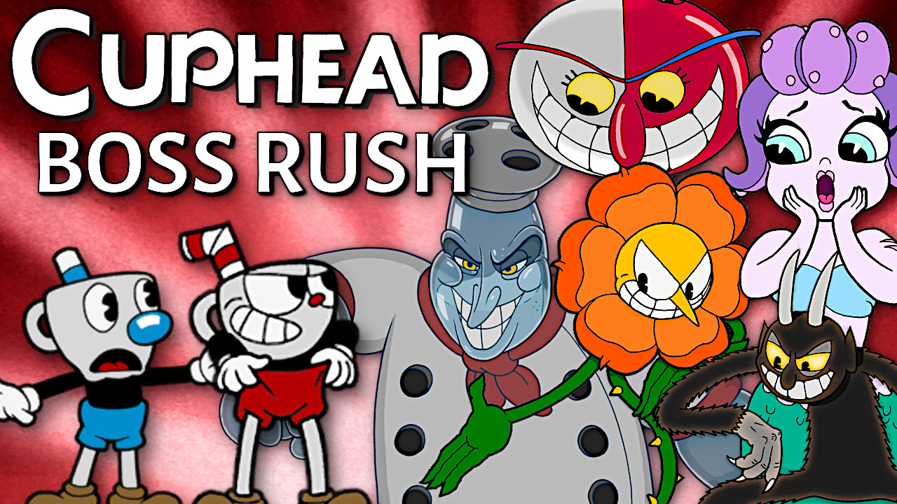

# Cuphead Boss Rush
This mod adds an entirely new Boss Rush mode to the game. Fight all 40 Bosses back-to-back with only a single life and a single loadout!

### Features:

* **Boss Rush**
  * Fight every boss in the game in a set order
  * This mode can be started from any boss in the game
    
* **Randomized Boss Rush**
  * Fight every boss in the game in a randomly selected order
  * This mode can be started at the Tutorial in Elder Kettle's House
    
* **Customization Options**
   * Difficulty: Choose between Simple, Regular, or Expert difficulty
   * Heal between Fights: If this is on, you will be healed to full health after each fight.
   * Rest Area every 3/4/5 Fights: This option will take you to the tutorial after a number of fights and allow you to heal 3 times by parrying and refill your super before going to the next fight.
     
* **Co-op play is supported for both modes**

### **This mod currently only supports Cuphead version 1.3.4 with or without the Delicious Last Course DLC installed!**

How to Install
===

Extract the zip in C:\Program Files (x86)\Steam\steamapps\common\Cuphead (or wherever you have Cuphead installed)

How to Play
===

1. Start the game and you should now see "Boss Rush Options" in the Pause Menu.

2. Turn on Boss Rush and customize the difficulty however you'd like.

3. Start Boss Rush from any level in the game or Random Boss Rush from Elder Kettle's House.
